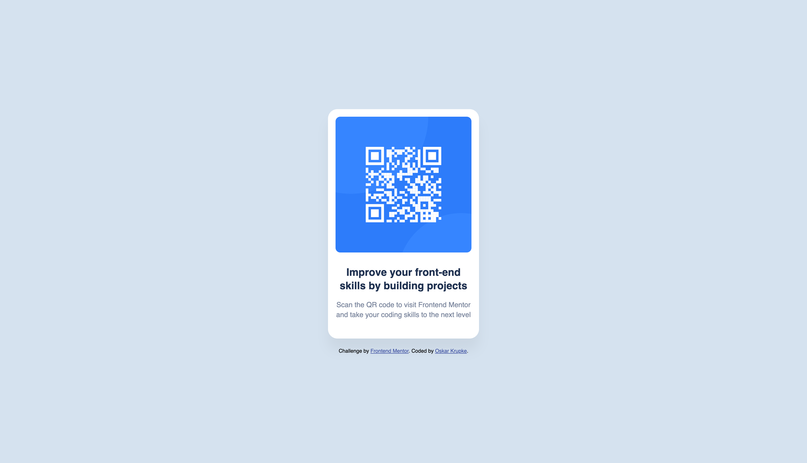

# Frontend Mentor - QR code component solution

This is a solution to the [QR code component challenge on Frontend Mentor](https://www.frontendmentor.io/challenges/qr-code-component-iux_sIO_H). Frontend Mentor challenges help you improve your coding skills by building realistic projects. 

## Table of contents

- [Overview](#overview)
  - [Screenshot](#screenshot)
  - [Links](#links)
- [My process](#my-process)
  - [Built with](#built-with)
  - [What I learned](#what-i-learned)
  - [Continued development](#continued-development)
  - [Useful resources](#useful-resources)
- [Author](#author)

## Overview

This project is a simple QR code component that displays a QR code image with accompanying text. The component is responsive and follows the design specifications provided by Frontend Mentor.

### Screenshot



### Links

- Solution URL: [GitHub Repository](https://github.com/okrupke/qr-code-component-main)
- Live Site URL: [Live Demo](https://okrupke.github.io/qr-code-component-main)

## My process

### Built with

- Semantic HTML5 markup
- CSS custom properties
- Flexbox for layout
- Mobile-first workflow
- Google Fonts (Outfit family)
- CSS Box-shadow for depth
- Modern CSS reset

### What I learned

This project helped me practice fundamental HTML and CSS skills, particularly:

1. **Semantic HTML Structure**: Used proper semantic elements like `<main>` for the main content area.

```html
<main class="qr-container">
  
  <h1 class="qr-title">Improve your front-end skills by building projects</h1>
  <p class="qr-description">Scan the QR code to visit Frontend Mentor and take your coding skills to the next level</p>
</main>
```

2. **CSS Flexbox for Centering**: Implemented modern centering techniques using Flexbox.

```css
body {
  display: flex;
  flex-direction: column;
  justify-content: center;
  align-items: center;
  min-height: 100vh;
}
```

3. **CSS Custom Properties and HSL Colors**: Used the exact color values from the style guide.

```css
.qr-container {
  background-color: hsl(0, 0%, 100%);
  border-radius: 20px;
  box-shadow: 0 25px 25px rgba(0, 0, 0, 0.05);
}
```

### Continued development

Areas I want to continue focusing on in future projects:

- CSS Grid layouts for more complex components
- Advanced responsive design patterns
- CSS animations and transitions
- Accessibility improvements (ARIA labels, focus states)
- CSS preprocessing with Sass/SCSS

### Useful resources

- [CSS Flexbox Guide](https://css-tricks.com/snippets/css/a-guide-to-flexbox/) - Comprehensive guide for Flexbox layout
- [Google Fonts](https://fonts.google.com/) - Used for the Outfit font family
- [HSL Color Picker](https://hslpicker.com/) - Helpful for understanding HSL color values
- [MDN Web Docs](https://developer.mozilla.org/) - Always useful for CSS reference

## Author

- Frontend Mentor - [@okrupke](https://www.frontendmentor.io/profile/okrupke)
- GitHub - [@okrupke](https://github.com/okrupke)
